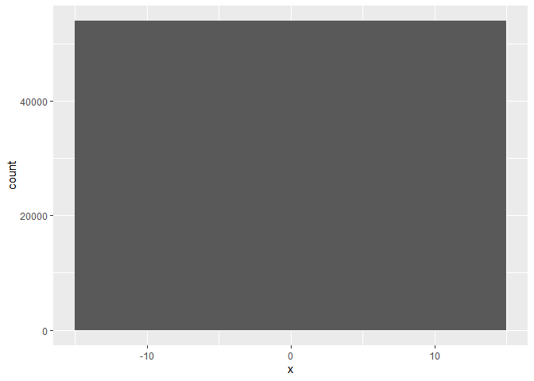
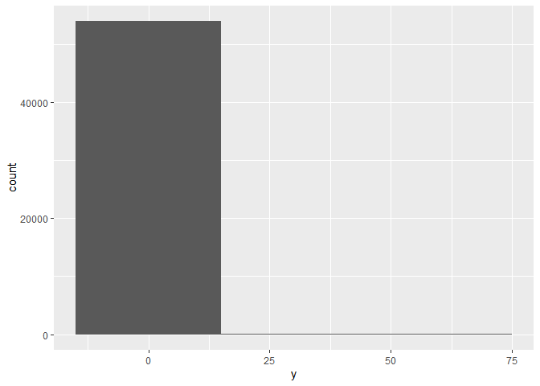
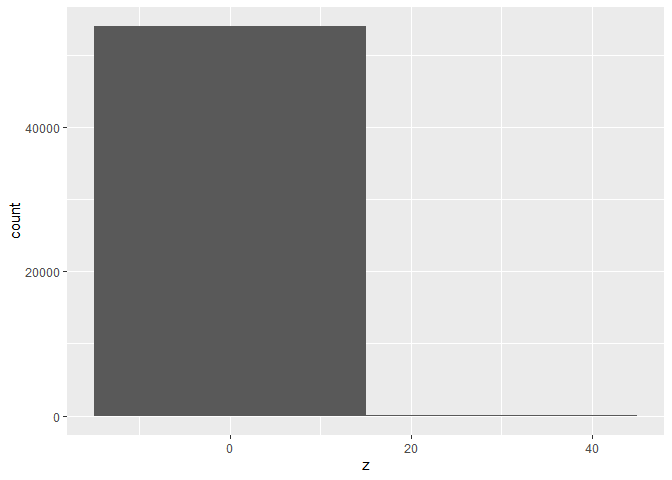
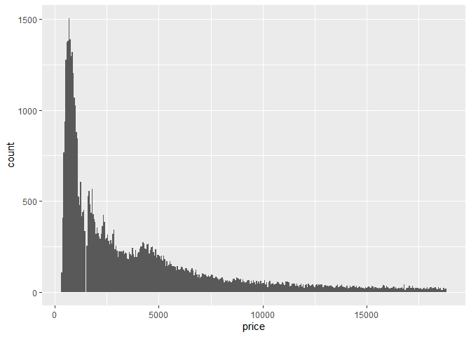
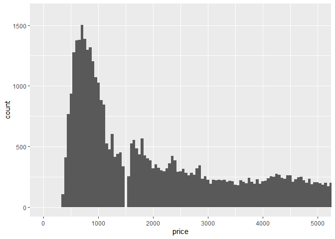
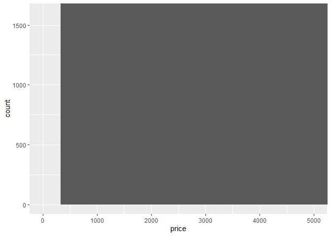
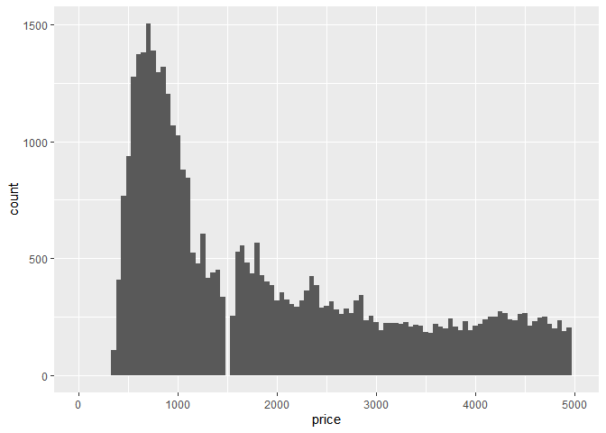
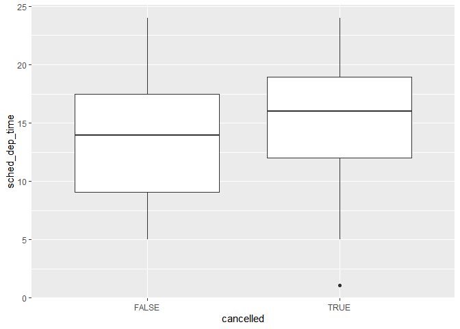
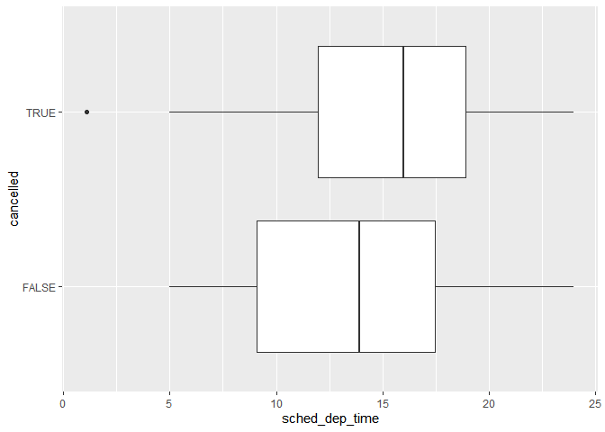

```r
library(tidyverse)
```

```
## -- Attaching packages -------------- tidyverse 1.2.1 --
```

```
## v ggplot2 3.2.0     v purrr   0.3.2
## v tibble  2.1.3     v dplyr   0.8.1
## v tidyr   0.8.3     v stringr 1.4.0
## v readr   1.3.1     v forcats 0.4.0
```

```
## -- Conflicts ----------------- tidyverse_conflicts() --
## x dplyr::filter() masks stats::filter()
## x dplyr::lag()    masks stats::lag()
```

```r
library(ggstance)
```

```
## Warning: package 'ggstance' was built under R version 3.6.1
```

```
## 
## Attaching package: 'ggstance'
```

```
## The following objects are masked from 'package:ggplot2':
## 
##     geom_errorbarh, GeomErrorbarh
```
##7.3.4 Exercises
  1. 

```r
ggplot(data = diamonds, mapping = aes(x = x)) + geom_histogram(binwidth = 30)
```

<!-- -->


```r
ggplot(data = diamonds, mapping = aes(x = y)) + geom_histogram(binwidth = 30)
```

<!-- -->

```r
ggplot(data = diamonds, mapping = aes(x = z)) + geom_histogram(binwidth = 30)
```

<!-- -->
There are more small diamonds than large diamonds.Diamonds are usually wider than they are tall or deep, so I would suppose the larger numbers are width and the smaller are length and depth.

  2.

```r
ggplot(data = diamonds) +
  geom_histogram(mapping = aes(x = price), binwidth = 50)
```

<!-- -->
There is nothing around the 1500 range which is surprising. 

  3. 

```r
diamonds %>% filter(between(carat, .96, 1.05)) %>%
  group_by(carat) %>% summarize(count = n())
```

```
## # A tibble: 10 x 2
##    carat count
##    <dbl> <int>
##  1  0.96   103
##  2  0.97    59
##  3  0.98    31
##  4  0.99    23
##  5  1     1558
##  6  1.01  2242
##  7  1.02   883
##  8  1.03   523
##  9  1.04   475
## 10  1.05   361
```
There are 23 .99 carrat diamonds and 1558 1 carrat diamonds. I am guessing because it looks nicer to have a 1 carat than .99 carat in the report.

  4. 

```r
ggplot(data = diamonds) +
  geom_histogram(mapping = aes(x = price), binwidth = 50) +
  coord_cartesian(xlim = c(0,5000), ylim = c(0,1600))
```

<!-- -->

```r
ggplot(data = diamonds) +
  geom_histogram(mapping = aes(x = price)) +
  coord_cartesian(xlim = c(0,5000), ylim = c(0,1600))
```

```
## `stat_bin()` using `bins = 30`. Pick better value with `binwidth`.
```

<!-- -->

```r
ggplot(data = diamonds) +
  geom_histogram(mapping = aes(x = price), binwidth = 50) +
  xlim(c(0,5000))
```

```
## Warning: Removed 14714 rows containing non-finite values (stat_bin).
```

```
## Warning: Removed 2 rows containing missing values (geom_bar).
```

<!-- -->

##7.4.1
  1. Histograms remove missing values as seen in an above chart. Bar graphs create a caegory for missing numbers. I am guessing because missing numbers cannot be numerically shown on a hustogram but can be grouped in a bar graph. 
  2. ne.ram determines if NA values are taken out before computing sum or mean by making ne.ram true or false. 
  
##7.5.1.1
  1. *describe this plz)*

```r
 nycflights13::flights %>% 
  mutate(
    cancelled = is.na(dep_time),
    sched_hour = sched_dep_time %/% 100,
    sched_min = sched_dep_time %% 100,
    sched_dep_time = sched_hour + sched_min / 60
  ) %>% 
  ggplot() +
  geom_boxplot(mapping = aes(x = cancelled, y = sched_dep_time))
```

<!-- -->
  
  2.

```r
  diamonds %>%
  mutate(cut = as.numeric(cut),
         color = as.numeric(color),
         clarity = as.numeric(clarity)) %>%
  select(price, everything()) %>%
  cor()
```

```
##               price       carat         cut       color     clarity
## price    1.00000000  0.92159130 -0.05349066  0.17251093 -0.14680007
## carat    0.92159130  1.00000000 -0.13496702  0.29143675 -0.35284057
## cut     -0.05349066 -0.13496702  1.00000000 -0.02051852  0.18917474
## color    0.17251093  0.29143675 -0.02051852  1.00000000  0.02563128
## clarity -0.14680007 -0.35284057  0.18917474  0.02563128  1.00000000
## depth   -0.01064740  0.02822431 -0.21805501  0.04727923 -0.06738444
## table    0.12713390  0.18161755 -0.43340461  0.02646520 -0.16032684
## x        0.88443516  0.97509423 -0.12556524  0.27028669 -0.37199853
## y        0.86542090  0.95172220 -0.12146187  0.26358440 -0.35841962
## z        0.86124944  0.95338738 -0.14932254  0.26822688 -0.36695200
##               depth      table           x           y           z
## price   -0.01064740  0.1271339  0.88443516  0.86542090  0.86124944
## carat    0.02822431  0.1816175  0.97509423  0.95172220  0.95338738
## cut     -0.21805501 -0.4334046 -0.12556524 -0.12146187 -0.14932254
## color    0.04727923  0.0264652  0.27028669  0.26358440  0.26822688
## clarity -0.06738444 -0.1603268 -0.37199853 -0.35841962 -0.36695200
## depth    1.00000000 -0.2957785 -0.02528925 -0.02934067  0.09492388
## table   -0.29577852  1.0000000  0.19534428  0.18376015  0.15092869
## x       -0.02528925  0.1953443  1.00000000  0.97470148  0.97077180
## y       -0.02934067  0.1837601  0.97470148  1.00000000  0.95200572
## z        0.09492388  0.1509287  0.97077180  0.95200572  1.00000000
```
Running a correlation matirx, carat is most correlated with price and therefore the most important determinant. There is a negative correlation with cut.

  3. 

```r
  nycflights13::flights %>% 
  mutate(
    cancelled = is.na(dep_time),
    sched_hour = sched_dep_time %/% 100,
    sched_min = sched_dep_time %% 100,
    sched_dep_time = sched_hour + sched_min / 60
  ) %>% 
  ggplot() +
  geom_boxploth(mapping = aes(y = cancelled, x = sched_dep_time))
```

<!-- -->
x and y had to be flipped to show the plot correctly. 

  5. 
  Violin plot is a compact way to show continuous data by combining a density graph and a box plot.
  Histogram also shows a continuous variable, but the variables have to fit into bins.
  
##7.5.2
  One example of a categorical covatiation plot would be plotting the car types and the kind of drive they have and visualizing wiht geom_count()
  
##7.5.3
  I could probably use my sunflowers time versus growth as two continuous variables and I would visualize with the box plot.

  
