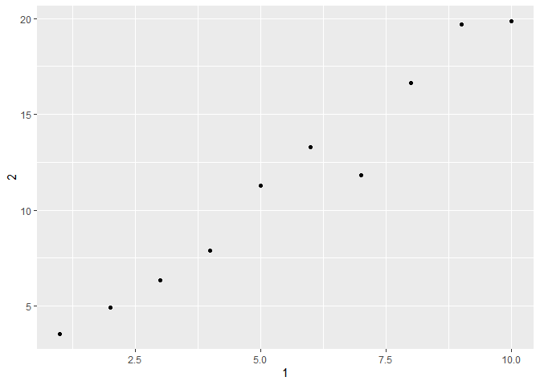

```r
library(tidyverse)
```

```
## -- Attaching packages -------------- tidyverse 1.2.1 --
```

```
## v ggplot2 3.2.0     v purrr   0.3.2
## v tibble  2.1.3     v dplyr   0.8.1
## v tidyr   0.8.3     v stringr 1.4.0
## v readr   1.3.1     v forcats 0.4.0
```

```
## -- Conflicts ----------------- tidyverse_conflicts() --
## x dplyr::filter() masks stats::filter()
## x dplyr::lag()    masks stats::lag()
```
##10.5 Exercises
 
  1. A tibble will say "A Tibble" in the first line and it also only prints the first ten rows and as many columns that can fit the screen. 
 
  2. Creating a tibble and creating a dataframe worked the same way. However, tibble doesnt do partial matching when pulling a variable, so while df$x worked with the dataframe, it didn't run for the tibble. Also a tibble will pull a column when running tdf[, "xyz"] while the dataframe code doesnt pull the column. 
  
```
  df <- data.frame(abc = 1, xyz = "a")
df$x
df[, "xyz"]
df[, c("abc", "xyz")]

tdf <- data.frame(abc = 1, xyz = "a")
tdf$x
tdf[, "xyz"]
tdf[, c("abc", "xyz")]
```
  4. 

```r
annoying <- tibble(
  `1` = 1:10,
  `2` = `1` * 2 + rnorm(length(`1`))
)

annoying$'1'
```

```
##  [1]  1  2  3  4  5  6  7  8  9 10
```

```r
annoying %>% ggplot() +
  geom_point(mapping = aes(x = `1`, y = `2`))
```

<!-- -->

```r
annoying$`3` <- annoying$`2` / annoying$`1`
annoying
```

```
## # A tibble: 10 x 3
##      `1`   `2`   `3`
##    <int> <dbl> <dbl>
##  1     1  3.56  3.56
##  2     2  4.90  2.45
##  3     3  6.33  2.11
##  4     4  7.91  1.98
##  5     5 11.3   2.26
##  6     6 13.3   2.22
##  7     7 11.8   1.69
##  8     8 16.6   2.08
##  9     9 19.7   2.19
## 10    10 19.8   1.98
```

```r
annoying %>% rename(one = `1`, two = `2`, three = `3`)
```

```
## # A tibble: 10 x 3
##      one   two three
##    <int> <dbl> <dbl>
##  1     1  3.56  3.56
##  2     2  4.90  2.45
##  3     3  6.33  2.11
##  4     4  7.91  1.98
##  5     5 11.3   2.26
##  6     6 13.3   2.22
##  7     7 11.8   1.69
##  8     8 16.6   2.08
##  9     9 19.7   2.19
## 10    10 19.8   1.98
```
  5. enframe() converts named atomic vectors or lists to one or two column dataframes. Lists will be converted to a nested tibble. 
  
##11.2.2 Exercises
  1. I would use read_delim() because it reads in files with any delimiter. 
  4. Using read_csv and specifying quote = "'" allows me to read the text in a dataframe.

```r
read_csv("x,y\n1,'a,b'", quote = "'")
```

```
## # A tibble: 1 x 2
##       x y    
##   <dbl> <chr>
## 1     1 a,b
```
  5.

```r
read_csv("a,b\n1,2,3\n4,5,6")
```

```
## Warning: 2 parsing failures.
## row col  expected    actual         file
##   1  -- 2 columns 3 columns literal data
##   2  -- 2 columns 3 columns literal data
```

```
## # A tibble: 2 x 2
##       a     b
##   <dbl> <dbl>
## 1     1     2
## 2     4     5
```
There are three columns but only two are specified in the header so the third was dropped.

```r
read_csv("a,b,c\n1,2\n1,2,3,4")
```

```
## Warning: 2 parsing failures.
## row col  expected    actual         file
##   1  -- 3 columns 2 columns literal data
##   2  -- 3 columns 4 columns literal data
```

```
## # A tibble: 2 x 3
##       a     b     c
##   <dbl> <dbl> <dbl>
## 1     1     2    NA
## 2     1     2     3
```
In the first row there isnt enough data to fill the columns and in the second there is too much data and one is dropped. 

```r
read_csv("a,b\n\"1")
```

```
## Warning: 2 parsing failures.
## row col                     expected    actual         file
##   1  a  closing quote at end of file           literal data
##   1  -- 2 columns                    1 columns literal data
```

```
## # A tibble: 1 x 2
##       a b    
##   <dbl> <chr>
## 1     1 <NA>
```
There are quotes that arent completed, messing up the code.

```r
read_csv("a,b\n1,2\na,b")
```

```
## # A tibble: 2 x 2
##   a     b    
##   <chr> <chr>
## 1 1     2    
## 2 a     b
```
The only difference from other columns I find is a and b being treated as character vectors.

```r
read_csv("a;b\n1;3")
```

```
## # A tibble: 1 x 1
##   `a;b`
##   <chr>
## 1 1;3
```
The columns are seperated by a semicolon, so I would use read_cvs2() insead for this data set. 

##11.3.5 Exercises
  1. locale sets defaults that can vary between countries such as date and time formats, decimals, grouping marks.
  
  2. R gives an error if decimal and grouping mark are the same.
  
```
locale(decimal_mark = ".", grouping_mark = ".")
```

Groupings are . if decimals are ,

```r
locale(decimal_mark = ",")
```

```
## <locale>
## Numbers:  123.456,78
## Formats:  %AD / %AT
## Timezone: UTC
## Encoding: UTF-8
## <date_names>
## Days:   Sunday (Sun), Monday (Mon), Tuesday (Tue), Wednesday (Wed),
##         Thursday (Thu), Friday (Fri), Saturday (Sat)
## Months: January (Jan), February (Feb), March (Mar), April (Apr), May
##         (May), June (Jun), July (Jul), August (Aug), September
##         (Sep), October (Oct), November (Nov), December (Dec)
## AM/PM:  AM/PM
```

Decimals are . if groupings are set to ,

```r
locale(grouping_mark = ",")
```

```
## <locale>
## Numbers:  123,456.78
## Formats:  %AD / %AT
## Timezone: UTC
## Encoding: UTF-8
## <date_names>
## Days:   Sunday (Sun), Monday (Mon), Tuesday (Tue), Wednesday (Wed),
##         Thursday (Thu), Friday (Fri), Saturday (Sat)
## Months: January (Jan), February (Feb), March (Mar), April (Apr), May
##         (May), June (Jun), July (Jul), August (Aug), September
##         (Sep), October (Oct), November (Nov), December (Dec)
## AM/PM:  AM/PM
```

  3. Date and time gives dafault date and time formats. It would be useful when inputing dates from a different language because months and days can be written out in words instead of numbers. Ensuring that the correct code is used for the date default setting would be important. 
  
  7.

```r
d1 <- "January 1, 2010"
d2 <- "2015-Mar-07"
d3 <- "06-Jun-2017"
d4 <- c("August 19 (2015)", "July 1 (2015)")
d5 <- "12/30/14" # Dec 30, 2014
t1 <- "1705"
t2 <- "11:15:10.12 PM"

parse_date(d1, "%B %d , %Y")
```

```
## [1] "2010-01-01"
```

```r
parse_date(d2, "%Y-%b-%d")
```

```
## [1] "2015-03-07"
```

```r
parse_date(d3, "%d-%b-%Y")
```

```
## [1] "2017-06-06"
```

```r
parse_date(d4, "%B %d (%Y)")
```

```
## [1] "2015-08-19" "2015-07-01"
```

```r
parse_date(d5, "%m/%d/%y")
```

```
## [1] "2014-12-30"
```

```r
parse_time(t1, "%H%M")
```

```
## 17:05:00
```

```r
parse_time(t2, "%H:%M:%OS %p")
```

```
## 23:15:10.12
```

