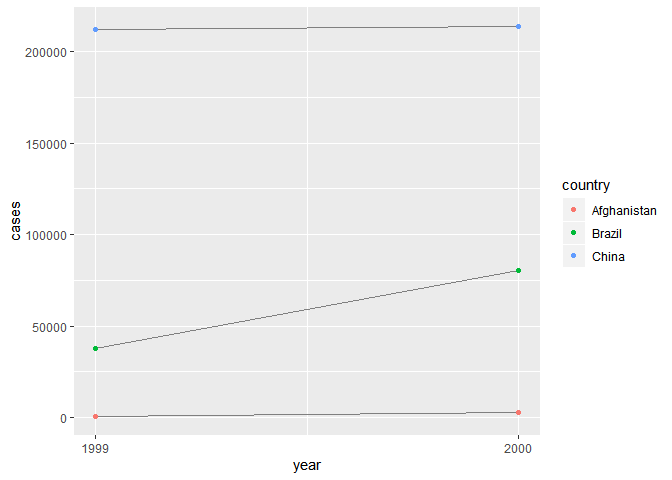

```r
library(tidyverse)
```

```
## -- Attaching packages -------------- tidyverse 1.2.1 --
```

```
## v ggplot2 3.2.0     v purrr   0.3.2
## v tibble  2.1.3     v dplyr   0.8.1
## v tidyr   0.8.3     v stringr 1.4.0
## v readr   1.3.1     v forcats 0.4.0
```

```
## -- Conflicts ----------------- tidyverse_conflicts() --
## x dplyr::filter() masks stats::filter()
## x dplyr::lag()    masks stats::lag()
```

##12.2.1 Exercises

  2. Filter TB cases per country per year and matching pop count
  

```r
countries <- filter(table2, type == 'cases')$country
years <- filter(table2, type == 'cases')$year
cases <- filter(table2, type == 'cases')$count
populations <- filter(table2, type == 'population')$count

table2_rate <- tibble(country = countries,
                      year = years,
                      rate = cases/populations * 10000)

table2_rate
```

```
## # A tibble: 6 x 3
##   country      year  rate
##   <chr>       <int> <dbl>
## 1 Afghanistan  1999 0.373
## 2 Afghanistan  2000 1.29 
## 3 Brazil       1999 2.19 
## 4 Brazil       2000 4.61 
## 5 China        1999 1.67 
## 6 China        2000 1.67
```


```r
table4c <-
  tibble(
    country = table4a$country,
    `1999` = table4a[["1999"]] / table4b[["1999"]] * 10000,
    `2000` = table4a[["2000"]] / table4b[["2000"]] * 10000
  )
table4c
```

```
## # A tibble: 3 x 3
##   country     `1999` `2000`
##   <chr>        <dbl>  <dbl>
## 1 Afghanistan  0.373   1.29
## 2 Brazil       2.19    4.61
## 3 China        1.67    1.67
```

Making it from the two different table 4s was slightly easier, less filtering.

  3. First I need to make sure only the cases are in the plot from the count column.
  

```r
table2 %>%
  filter(type == "cases") %>%
  ggplot(aes(year, count)) +
  geom_line(aes(group = country), colour = "grey50") +
  geom_point(aes(colour = country)) +
  scale_x_continuous(breaks = unique(table2$year)) +
  ylab("cases") 
```

<!-- -->

##12.3.3

  1. The columns were shifted around in the two different stocks data sets. The year column also changed from a chr to dbl.
  

```r
stocks <- tibble(
  year = c(2015, 2015, 2016, 2016),
  half = c(1, 2, 1, 2),
  return = c(1.88, 0.59, 0.92, 0.17)
)
stocks
```

```
## # A tibble: 4 x 3
##    year  half return
##   <dbl> <dbl>  <dbl>
## 1  2015     1   1.88
## 2  2015     2   0.59
## 3  2016     1   0.92
## 4  2016     2   0.17
```

```r
stocks %>%
  spread(year, return) %>%
  gather(`2015`:`2016`, key = "year", value = "return")
```

```
## # A tibble: 4 x 3
##    half year  return
##   <dbl> <chr>  <dbl>
## 1     1 2015    1.88
## 2     2 2015    0.59
## 3     1 2016    0.92
## 4     2 2016    0.17
```
  
  2. The code didnt work becuse the years need back ticks around them, so they can be counted as variables instead of numbers.
```
table4a %>% 
  gather(1999, 2000, key = "year", value = "cases")
```
3. Spread doesnt work because there are two Phillip Woods with age as the key. Adding another colum to differentiate between the Phillips would allow for spreading.For example:


```r
people <- tribble(
  ~name,             ~key,    ~value,
  #-----------------|--------|------
  "Phillip Woods",   "age",       45,
  "Phillip Woods",   "height",   186,
  "Phillip Woods",   "age",       50,
  "Jessica Cordero", "age",       37,
  "Jessica Cordero", "height",   156
)
people$id <- c(1, 1, 2, 1, 1)
people
```

```
## # A tibble: 5 x 4
##   name            key    value    id
##   <chr>           <chr>  <dbl> <dbl>
## 1 Phillip Woods   age       45     1
## 2 Phillip Woods   height   186     1
## 3 Phillip Woods   age       50     2
## 4 Jessica Cordero age       37     1
## 5 Jessica Cordero height   156     1
```

  4. 

```r
preg <- tribble(
  ~pregnant, ~male, ~female,
  "yes",     NA,    10,
  "no",      20,    12
)
preg %>%
  gather(key = 'gender', value = 'count', 2:3 , na.rm = TRUE)
```

```
## # A tibble: 3 x 3
##   pregnant gender count
##   <chr>    <chr>  <dbl>
## 1 no       male      20
## 2 yes      female    10
## 3 no       female    12
```

##12.4.3

  1. 
```
tibble(x = c("a,b,c", "d,e,f,g", "h,i,j")) %>%
  separate(x, c("one", "two", "three"))
```
A warning pops up about additional pieces being disgarded. 


```r
tibble(x = c("a,b,c", "d,e,f,g", "h,i,j")) %>%
  separate(x, c("one", "two", "three"), extra = "drop")
```

```
## # A tibble: 3 x 3
##   one   two   three
##   <chr> <chr> <chr>
## 1 a     b     c    
## 2 d     e     f    
## 3 h     i     j
```
Adding extra can either drop the additional value without the warning message, or add it on to the last value in the row. 

```r
tibble(x = c("a,b,c", "d,e,f,g", "h,i,j")) %>%
  separate(x, c("one", "two", "three"), extra = "merge")
```

```
## # A tibble: 3 x 3
##   one   two   three
##   <chr> <chr> <chr>
## 1 a     b     c    
## 2 d     e     f,g  
## 3 h     i     j
```

```
tibble(x = c("a,b,c", "d,e", "f,g,i")) %>%
  separate(x, c("one", "two", "three"))
```
A warning pops up about a missing value, but fil can add an NA to the right or left most column without the warning. 

```r
tibble(x = c("a,b,c", "d,e", "f,g,i")) %>%
  separate(x, c("one", "two", "three"), fill = "right")
```

```
## # A tibble: 3 x 3
##   one   two   three
##   <chr> <chr> <chr>
## 1 a     b     c    
## 2 d     e     <NA> 
## 3 f     g     i
```

  2. Remove discards input columns in the output data frame. You set it to false to create a new variable, but keep the old one. 
  
  3. You can only select one column for extract and seperate, but there are many ways to split up the column into different columns. Unite can choose many columns but combine to only one vector. 
  
##12.6.1

  3.??
  

```r
who 
```

```
## # A tibble: 7,240 x 60
##    country iso2  iso3   year new_sp_m014 new_sp_m1524 new_sp_m2534
##    <chr>   <chr> <chr> <int>       <int>        <int>        <int>
##  1 Afghan~ AF    AFG    1980          NA           NA           NA
##  2 Afghan~ AF    AFG    1981          NA           NA           NA
##  3 Afghan~ AF    AFG    1982          NA           NA           NA
##  4 Afghan~ AF    AFG    1983          NA           NA           NA
##  5 Afghan~ AF    AFG    1984          NA           NA           NA
##  6 Afghan~ AF    AFG    1985          NA           NA           NA
##  7 Afghan~ AF    AFG    1986          NA           NA           NA
##  8 Afghan~ AF    AFG    1987          NA           NA           NA
##  9 Afghan~ AF    AFG    1988          NA           NA           NA
## 10 Afghan~ AF    AFG    1989          NA           NA           NA
## # ... with 7,230 more rows, and 53 more variables: new_sp_m3544 <int>,
## #   new_sp_m4554 <int>, new_sp_m5564 <int>, new_sp_m65 <int>,
## #   new_sp_f014 <int>, new_sp_f1524 <int>, new_sp_f2534 <int>,
## #   new_sp_f3544 <int>, new_sp_f4554 <int>, new_sp_f5564 <int>,
## #   new_sp_f65 <int>, new_sn_m014 <int>, new_sn_m1524 <int>,
## #   new_sn_m2534 <int>, new_sn_m3544 <int>, new_sn_m4554 <int>,
## #   new_sn_m5564 <int>, new_sn_m65 <int>, new_sn_f014 <int>,
## #   new_sn_f1524 <int>, new_sn_f2534 <int>, new_sn_f3544 <int>,
## #   new_sn_f4554 <int>, new_sn_f5564 <int>, new_sn_f65 <int>,
## #   new_ep_m014 <int>, new_ep_m1524 <int>, new_ep_m2534 <int>,
## #   new_ep_m3544 <int>, new_ep_m4554 <int>, new_ep_m5564 <int>,
## #   new_ep_m65 <int>, new_ep_f014 <int>, new_ep_f1524 <int>,
## #   new_ep_f2534 <int>, new_ep_f3544 <int>, new_ep_f4554 <int>,
## #   new_ep_f5564 <int>, new_ep_f65 <int>, newrel_m014 <int>,
## #   newrel_m1524 <int>, newrel_m2534 <int>, newrel_m3544 <int>,
## #   newrel_m4554 <int>, newrel_m5564 <int>, newrel_m65 <int>,
## #   newrel_f014 <int>, newrel_f1524 <int>, newrel_f2534 <int>,
## #   newrel_f3544 <int>, newrel_f4554 <int>, newrel_f5564 <int>,
## #   newrel_f65 <int>
```

```r
who1 <- who %>% 
  gather(new_sp_m014:newrel_f65, key = "key", value = "cases", na.rm = TRUE)

who2 <- who1 %>% 
  mutate(key = stringr::str_replace(key, "newrel", "new_rel"))

who3 <- who2 %>% 
  separate(key, c("new", "type", "sexage"), sep = "_")
```

```r
select(who3, country, iso2, iso3) %>%
  distinct() %>%
  group_by(country) %>%
  filter(n() > 1)
```

```
## # A tibble: 0 x 3
## # Groups:   country [0]
## # ... with 3 variables: country <chr>, iso2 <chr>, iso3 <chr>
```

  4. 
  

```r
who %>%
  gather(code, value, new_sp_m014:newrel_f65, na.rm = TRUE) %>% 
  mutate(code = stringr::str_replace(code, "newrel", "new_rel")) %>%
  separate(code, c("new", "var", "sexage")) %>% 
  select(-new, -iso2, -iso3) %>% 
  separate(sexage, c("sex", "age"), sep = 1) %>%
  group_by(country, year, sex) %>%
  summarize(total_case = sum(value)) %>%
  unite(country_sex, country, sex, remove = FALSE) %>%
  ggplot() +
  geom_line(mapping = aes(x = year, y = total_case, color = sex,
                          group = country_sex))
```

<!-- -->


