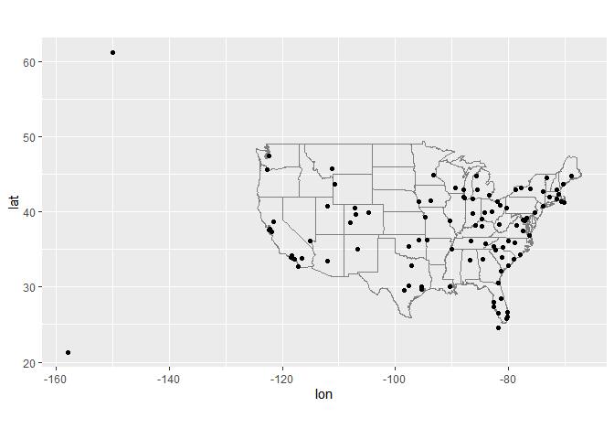
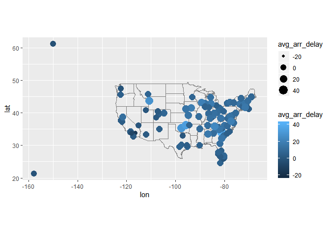
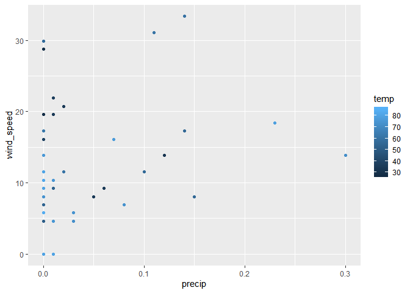
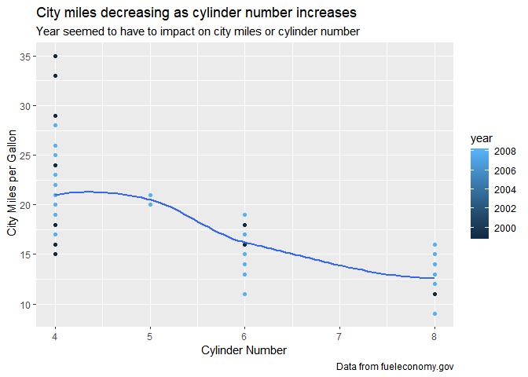
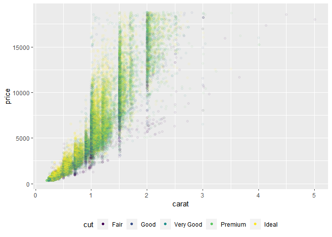

```r
library(tidyverse)
```

```
## -- Attaching packages -------------- tidyverse 1.2.1 --
```

```
## v ggplot2 3.2.0     v purrr   0.3.2
## v tibble  2.1.3     v dplyr   0.8.1
## v tidyr   0.8.3     v stringr 1.4.0
## v readr   1.3.1     v forcats 0.4.0
```

```
## -- Conflicts ----------------- tidyverse_conflicts() --
## x dplyr::filter() masks stats::filter()
## x dplyr::lag()    masks stats::lag()
```

```r
library(nycflights13)
library(babynames)
```

```
## Warning: package 'babynames' was built under R version 3.6.1
```

```r
library(maps)
```

```
## Warning: package 'maps' was built under R version 3.6.1
```

```
## 
## Attaching package: 'maps'
```

```
## The following object is masked from 'package:purrr':
## 
##     map
```

##13.2.1 Exercises

  1. I would want to combine flights and airports because flights has the origin and destination and airports has the longitude and latitude needed for mapping. 
  
  2. faa and origin connect between airports and flights, so the same connection can be made between faa and the origin in weathers. 
  
  3. If there were weather records for every airport then weather could also be connected to destination. 
  
  4. I would create a new table with month, day, and year of special holidays that people fly less during. My new table would connect to the month, day, and year in flights and weather. 
  
##13.3.1 Exercises
  
  1. 
  

```r
flights %>%
  mutate(index = row_number()) %>%
  select(index, everything())
```

```
## # A tibble: 336,776 x 20
##    index  year month   day dep_time sched_dep_time dep_delay arr_time
##    <int> <int> <int> <int>    <int>          <int>     <dbl>    <int>
##  1     1  2013     1     1      517            515         2      830
##  2     2  2013     1     1      533            529         4      850
##  3     3  2013     1     1      542            540         2      923
##  4     4  2013     1     1      544            545        -1     1004
##  5     5  2013     1     1      554            600        -6      812
##  6     6  2013     1     1      554            558        -4      740
##  7     7  2013     1     1      555            600        -5      913
##  8     8  2013     1     1      557            600        -3      709
##  9     9  2013     1     1      557            600        -3      838
## 10    10  2013     1     1      558            600        -2      753
## # ... with 336,766 more rows, and 12 more variables: sched_arr_time <int>,
## #   arr_delay <dbl>, carrier <chr>, flight <int>, tailnum <chr>,
## #   origin <chr>, dest <chr>, air_time <dbl>, distance <dbl>, hour <dbl>,
## #   minute <dbl>, time_hour <dttm>
```


  2a. playerID, yearID, and stint are all keys for the Lahman::batting data. playerID and yearID are not primary keys becuse a player can play on different teams in the same year. 
  
  
  2b. year, sex, and name are all keys for the babynames::babynames data set. Year and name are not promary keys because babues with the same name can be born in the same year.
  
##13.4.6 Exercises

  1.
  Spatial distribution of delays

```r
airports %>%
  semi_join(flights, c("faa" = "dest")) %>%
  ggplot(aes(lon, lat)) +
    borders("state") +
    geom_point() +
    coord_quickmap()
```

<!-- -->


```r
flights %>% group_by(dest) %>%
  summarize(avg_arr_delay = mean(arr_delay, na.rm = TRUE)) %>%
  left_join(airports, by = c('dest' = 'faa')) %>%
  ggplot(aes(x = lon, y = lat, size = avg_arr_delay, color = avg_arr_delay)) +
  borders('state') +
  geom_point() +
  coord_quickmap()
```

```
## Warning: Removed 5 rows containing missing values (geom_point).
```

<!-- -->
Average delays per airport

  2. 

```r
flights %>% 
  left_join(airports, by = c('dest' = 'faa')) %>%
  left_join(airports, by = c('origin' = 'faa'), suffix = c('.dest', '.origin')) %>%
  select(dest, origin, contains('lat'), contains('lon'))
```

```
## # A tibble: 336,776 x 6
##    dest  origin lat.dest lat.origin lon.dest lon.origin
##    <chr> <chr>     <dbl>      <dbl>    <dbl>      <dbl>
##  1 IAH   EWR        30.0       40.7    -95.3      -74.2
##  2 IAH   LGA        30.0       40.8    -95.3      -73.9
##  3 MIA   JFK        25.8       40.6    -80.3      -73.8
##  4 BQN   JFK        NA         40.6     NA        -73.8
##  5 ATL   LGA        33.6       40.8    -84.4      -73.9
##  6 ORD   EWR        42.0       40.7    -87.9      -74.2
##  7 FLL   EWR        26.1       40.7    -80.2      -74.2
##  8 IAD   LGA        38.9       40.8    -77.5      -73.9
##  9 MCO   JFK        28.4       40.6    -81.3      -73.8
## 10 ORD   LGA        42.0       40.8    -87.9      -73.9
## # ... with 336,766 more rows
```
  
##13.5.1

  2. 

```r
 flights_100 <- flights %>%
  filter(!is.na(dep_delay)) %>%
  group_by(tailnum) %>%
  summarize(n = n()) %>%
  filter(n > 100)

flights %>%
  semi_join(flights_100, by = 'tailnum')
```

```
## # A tibble: 225,766 x 19
##     year month   day dep_time sched_dep_time dep_delay arr_time
##    <int> <int> <int>    <int>          <int>     <dbl>    <int>
##  1  2013     1     1      517            515         2      830
##  2  2013     1     1      533            529         4      850
##  3  2013     1     1      544            545        -1     1004
##  4  2013     1     1      554            558        -4      740
##  5  2013     1     1      555            600        -5      913
##  6  2013     1     1      557            600        -3      709
##  7  2013     1     1      557            600        -3      838
##  8  2013     1     1      558            600        -2      849
##  9  2013     1     1      558            600        -2      853
## 10  2013     1     1      558            600        -2      923
## # ... with 225,756 more rows, and 12 more variables: sched_arr_time <int>,
## #   arr_delay <dbl>, carrier <chr>, flight <int>, tailnum <chr>,
## #   origin <chr>, dest <chr>, air_time <dbl>, distance <dbl>, hour <dbl>,
## #   minute <dbl>, time_hour <dttm>
```

  4. 48 hours of worst delays cross referened with weather

```r
worst_hours <- flights %>%
   group_by(origin, year, month, day, hour) %>%
  summarise(dep_delay = mean(dep_delay, na.rm = TRUE)) %>%
  ungroup() %>%
  arrange(desc(dep_delay)) %>%
  slice(1:48)
weather_most_delayed <- semi_join(weather, worst_hours,
  by = c(
    "origin", "year",
    "month", "day", "hour"
  )
)
select(weather_most_delayed, temp, wind_speed, precip) %>%
  print(n = 48)
```

```
## # A tibble: 48 x 3
##     temp wind_speed precip
##    <dbl>      <dbl>  <dbl>
##  1  27.0      13.8    0   
##  2  28.0      19.6    0   
##  3  28.9      28.8    0   
##  4  33.8       9.21   0.06
##  5  34.0       8.06   0.05
##  6  80.1       8.06   0   
##  7  86        13.8    0   
##  8  73.4       6.90   0.08
##  9  84.0       5.75   0   
## 10  78.8      18.4    0.23
## 11  53.6       0      0   
## 12  60.8      31.1    0.11
## 13  55.4      17.3    0.14
## 14  53.1       9.21   0.01
## 15  55.9      11.5    0.1 
## 16  55.4       8.06   0.15
## 17  57.0      29.9    0   
## 18  33.8      20.7    0.02
## 19  34.0      19.6    0.01
## 20  36.0      21.9    0.01
## 21  37.9      16.1    0   
## 22  32        13.8    0.12
## 23  60.1      33.4    0.14
## 24  60.8      11.5    0.02
## 25  62.1      17.3    0   
## 26  66.9      10.4    0   
## 27  66.9      13.8    0   
## 28  79.0      10.4    0   
## 29  77        16.1    0.07
## 30  75.9      13.8    0   
## 31  82.4       8.06   0   
## 32  86         9.21   0   
## 33  80.1       9.21   0   
## 34  80.6      11.5    0   
## 35  78.1       6.90   0   
## 36  75.2      10.4    0.01
## 37  73.9       5.75   0.03
## 38  73.9       8.06   0   
## 39  75.0       4.60   0   
## 40  75.0       4.60   0.01
## 41  80.1       0      0.01
## 42  80.1       0      0   
## 43  77        10.4    0   
## 44  82.0      10.4    0   
## 45  72.0      13.8    0.3 
## 46  72.0       4.60   0.03
## 47  51.1       4.60   0   
## 48  54.0       6.90   0
```


```r
ggplot(weather_most_delayed, aes(x = precip, y = wind_speed, color = temp)) +
  geom_point()
```

<!-- -->

##28.2.1
  
  1. 

```r
 ggplot(mpg, aes(cyl, cty)) +     geom_point(aes(color = year))     +  geom_smooth(se=FALSE) + labs(title = "City miles decreasing as cylinder number increases",
    subtitle = "Year seemed to have to impact on city miles or cylinder number",
    caption = "Data from fueleconomy.gov",
    x = "Cylinder Number",
    y = " City Miles per Gallon"
  )
```

```
## `geom_smooth()` using method = 'loess' and formula 'y ~ x'
```

```
## Warning in simpleLoess(y, x, w, span, degree = degree, parametric =
## parametric, : pseudoinverse used at 6
```

```
## Warning in simpleLoess(y, x, w, span, degree = degree, parametric =
## parametric, : neighborhood radius 2
```

```
## Warning in simpleLoess(y, x, w, span, degree = degree, parametric =
## parametric, : reciprocal condition number 3.2687e-015
```

<!-- -->

##28.4.4

  1. It does not override the default scale because the colors in geom_hex() are set by the fill aesthetic, not the color aesthetic.
  
  4. 

```r
ggplot(diamonds, aes(carat, price)) +
  geom_point(aes(colour = cut), alpha = 1 / 20) +
  theme(legend.position = "bottom") +
  guides(colour = guide_legend(nrow = 1, override.aes = list(alpha = 1)))
```

<!-- -->

